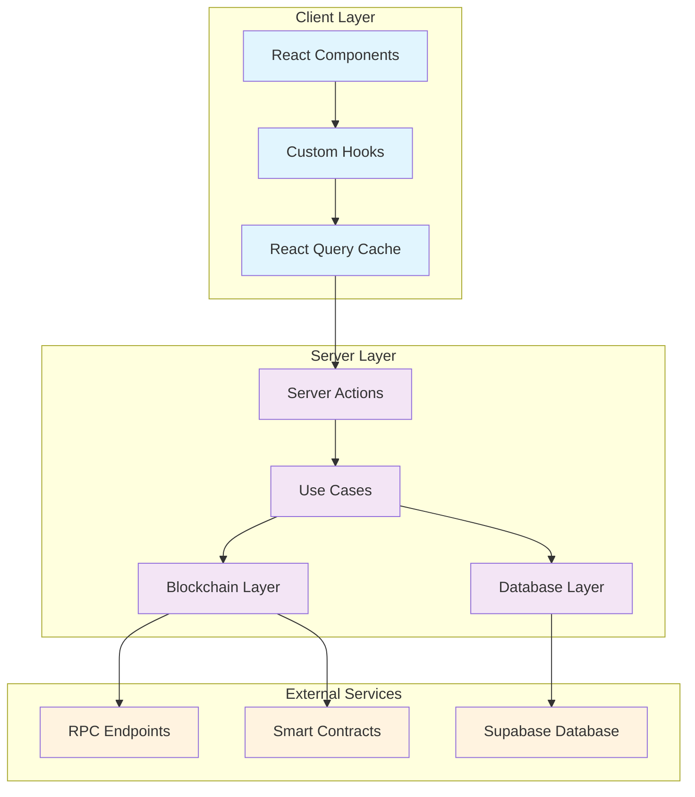
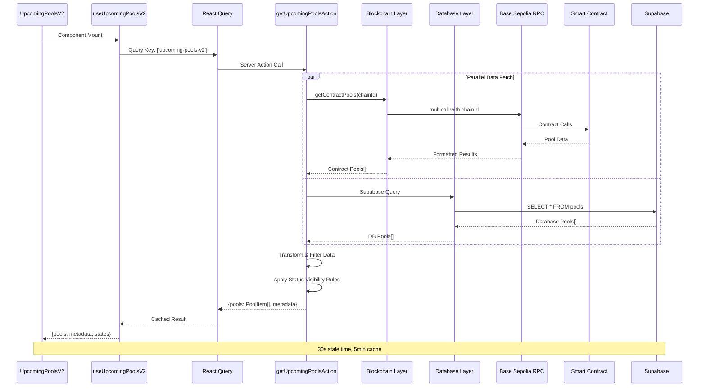
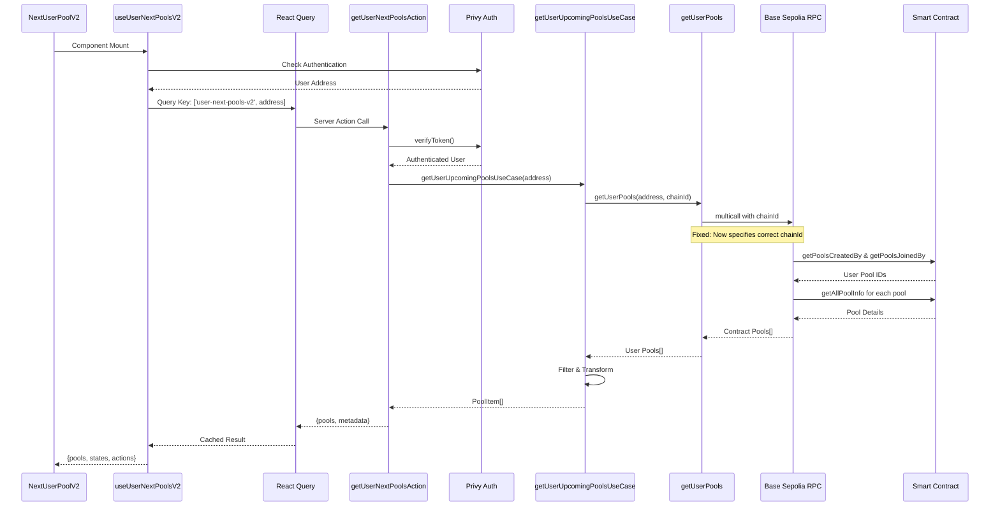
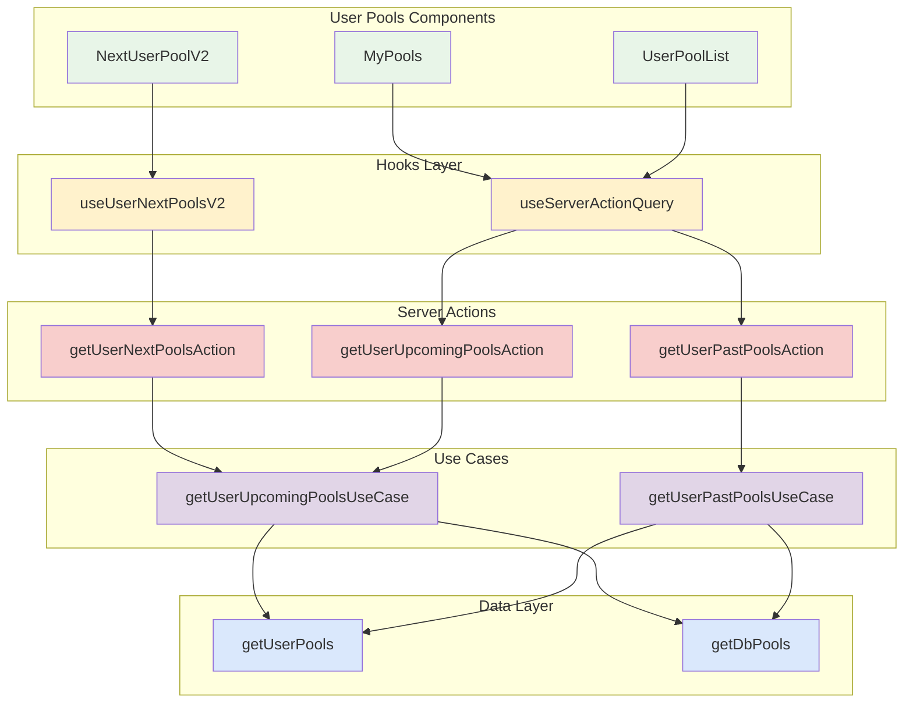
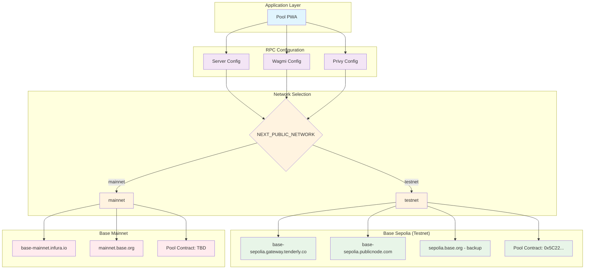
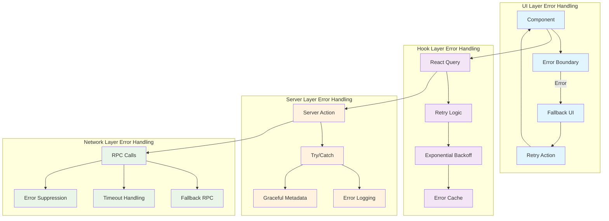
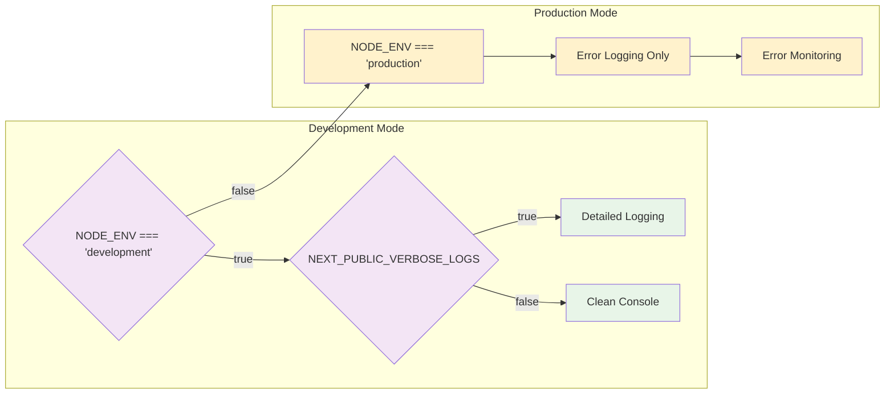

# System Architecture Overview

This document provides a comprehensive overview of the Pool PWA system architecture, including recent improvements to data fetching, RPC configuration, and user pools management.

## 📋 Table of Contents

-   [Architecture Overview](#architecture-overview)
-   [Data Flow Architecture](#data-flow-architecture)
-   [User Pools System](#user-pools-system)
-   [RPC Configuration](#rpc-configuration)
-   [Error Handling Strategy](#error-handling-strategy)
-   [Performance Optimizations](#performance-optimizations)

## 🏗️ Architecture Overview



## 🔄 Data Flow Architecture

### Upcoming Pools Flow



### User Pools Flow



## 👤 User Pools System

### Component Architecture



## 🌐 RPC Configuration

### Network Architecture



### Multicall Fix Implementation

```mermaid
graph LR
    subgraph "Before Fix ❌"
        MC1[multicall(serverConfig, {...})]
        RPC1[Uses default/mainnet RPC]
        ERROR1[❌ Wrong chain data]
    end

    subgraph "After Fix ✅"
        PC[getPublicClient(chainId)]
        CID[actualChainId = client.chain?.id]
        MC2[multicall(serverConfig, {chainId, ...})]
        RPC2[Uses correct Base Sepolia RPC]
        SUCCESS[✅ Correct chain data]
    end

    MC1 --> RPC1 --> ERROR1
    PC --> CID --> MC2 --> RPC2 --> SUCCESS

    classDef error fill:#ffebee
    classDef success fill:#e8f5e8
    classDef process fill:#fff3e0

    class MC1,RPC1,ERROR1 error
    class PC,CID,MC2,RPC2,SUCCESS success
```

## 🛡️ Error Handling Strategy

### Error Boundary Architecture



## ⚡ Performance Optimizations

### Caching Strategy

```mermaid
graph TB
    subgraph "React Query Cache Layers"
        QK[Query Keys]
        ST[Stale Time: 30s]
        GC[Garbage Collection: 5min]
        BG[Background Refetch]
    end

    subgraph "Data Fetching Strategy"
        PAR[Parallel Fetching]
        BATCH[Multicall Batching]
        FALL[Graceful Fallbacks]
        RETRY[Smart Retry Logic]
    end

    subgraph "UI Optimization"
        LAZY[Lazy Loading]
        SKEL[Skeleton States]
        MEMO[React.memo]
        COMP[Component Splitting]
    end

    subgraph "Network Optimization"
        POOL[Connection Pooling]
        CACHE_RPC[RPC Response Cache]
        DEBOUNCE[Request Debouncing]
        TIMEOUT[Request Timeouts]
    end

    QK --> ST
    ST --> GC
    GC --> BG

    PAR --> BATCH
    BATCH --> FALL
    FALL --> RETRY

    LAZY --> SKEL
    SKEL --> MEMO
    MEMO --> COMP

    POOL --> CACHE_RPC
    CACHE_RPC --> DEBOUNCE
    DEBOUNCE --> TIMEOUT

    classDef cache fill:#e8f5e8
    classDef fetch fill:#fff2cc
    classDef ui fill:#e1f5fe
    classDef network fill:#f3e5f5

    class QK,ST,GC,BG cache
    class PAR,BATCH,FALL,RETRY fetch
    class LAZY,SKEL,MEMO,COMP ui
    class POOL,CACHE_RPC,DEBOUNCE,TIMEOUT network
```



## 🔧 Development Tools

### Logging Strategy



## 📊 Key Metrics

-   **Upcoming Pools**: 172 contract pools → 21 visible pools (12% sync rate)
-   **Cache Performance**: 30s stale time, 5min garbage collection
-   **Error Recovery**: 3 retry attempts with exponential backoff
-   **RPC Reliability**: Multiple fallback endpoints with automatic failover
-   **Build Performance**: ~45s with optimized bundling
-   **Console Noise**: Reduced by 90% in development mode

## 🚀 Recent Improvements

1. **RPC Configuration Fixed**: Both general and user pools now correctly target Base Sepolia
2. **User Pools Rewritten**: Complete V2 implementation with robust error handling
3. **Console Cleanup**: Development logging now conditional on verbose flag
4. **Performance Enhanced**: Parallel data fetching and smart caching strategies
5. **Error Boundaries**: Comprehensive error handling with user-friendly retry mechanisms

---

_Last updated: December 19, 2024_
_Architecture reflects Pool PWA v2.0 improvements_
